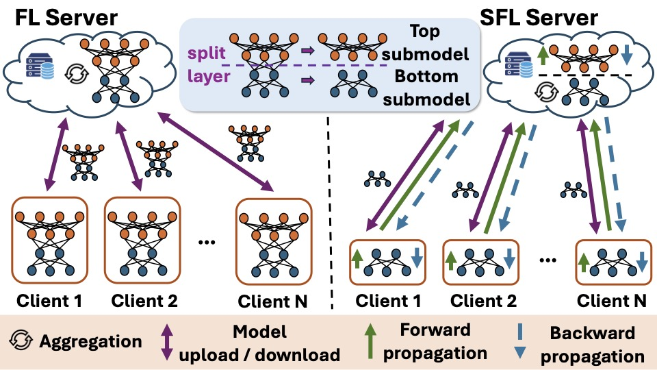
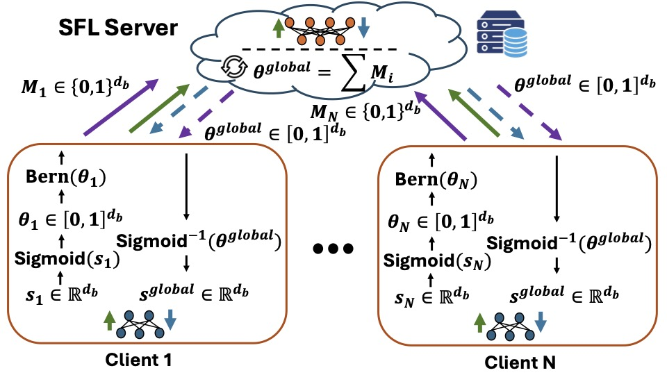

# PM-SFL (KDD 2026)

This repository contains the reference implementation for the KDD 2026 paper:

**Towards Privacy-Preserving and Heterogeneity-aware Split Federated Learning via Probabilistic Masking**

## Overview
We present *PM-SFL*, a robust split federated learning (SFL) framework designed to mitigate reconstruction attacks through probabilistic masking while preserving model utility.

### 1. Split Federated Learning (SFL)
PM-SFL is built upon the Split Federated Learning architecture. The model is partitioned at a **split layer** into a **bottom submodel** managed by the clients and a **top submodel** managed by the SFL server. This architecture facilitates seamless forward and backward propagation across the network while preserving data privacy and significantly offloading the computational burden from resource-constrained clients to the server.


*Figure 1: Illustration of Federated Learning and Split Federated Learning.*

### 2. Probabilistic Masking (PM)
To defend against reconstruction attacks, we introduce a probabilistic masking mechanism. Each client $i$ maintains **probabilistic masking parameters** $\theta_i \in [0, 1]^{d_b}$. From these parameters, a **binary mask** $M_i \in \{0, 1\}^{d_b}$ is sampled using a Bernoulli distribution: $M_i \sim Bern(\theta_i)$. 

These parameters are aggregated by the server to form a **global masking state** $\theta^{global}$, ensuring the model maintains high utility while providing robust privacy guarantees.


*Figure 2: Probabilistic Mask Training in Split Federated Learning.*

## Requirements
- **Python:** >= 3.8
- **PyTorch:** 1.13.1
- **CUDA:** 11.7 (Compatible with drivers supporting up to 13.0)
- **Hardware:** Tested on NVIDIA RTX A6000

## Project Structure

```text
   PM-SFL/
   ├── data/                   # Dataset directory
   ├── figures/                # Diagrams
   ├── log/                    # Training logs and performance metrics
   ├── models/                 # Neural network architectures
   ├── utils/                  # Training and configuration helpers
   ├── main.py                 # Main execution script
   ├── requirements.txt        # Python dependencies
   ├── .gitignore              # Git exclusion rules
   └── LICENSE                 # Project license
```

## Installation
```bash
   pip install -r requirements.txt
```

## Training and Evaluation
Our code is designed to automatically print the evaluation results during training. Users do not need to take additional steps for evaluation.

## Usage

1. **To run the main algorithm**:

```bash
   python -u main.py --training_method mask --aggregation_method binary
```

2. **(Optional) To run standard weight training (Baseline)**:

```bash
   python -u main.py
```